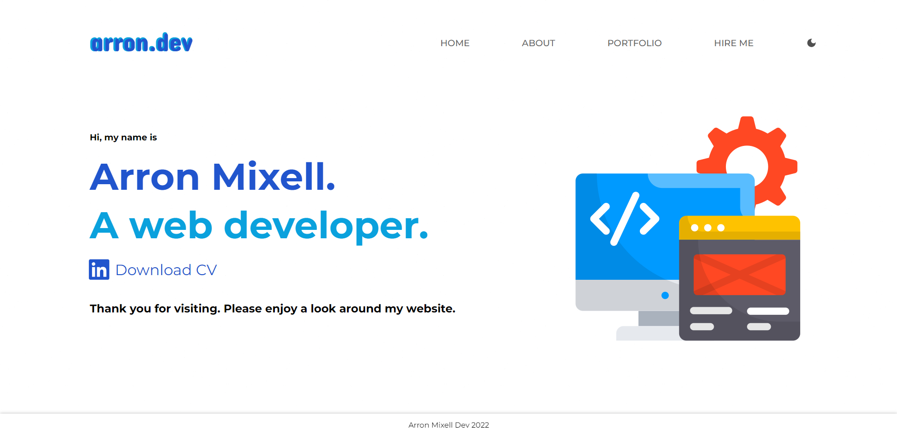
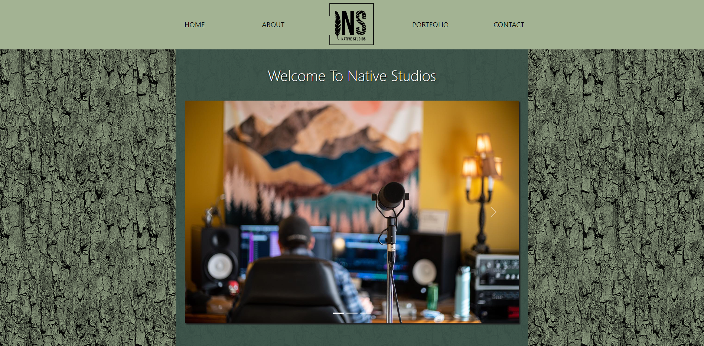
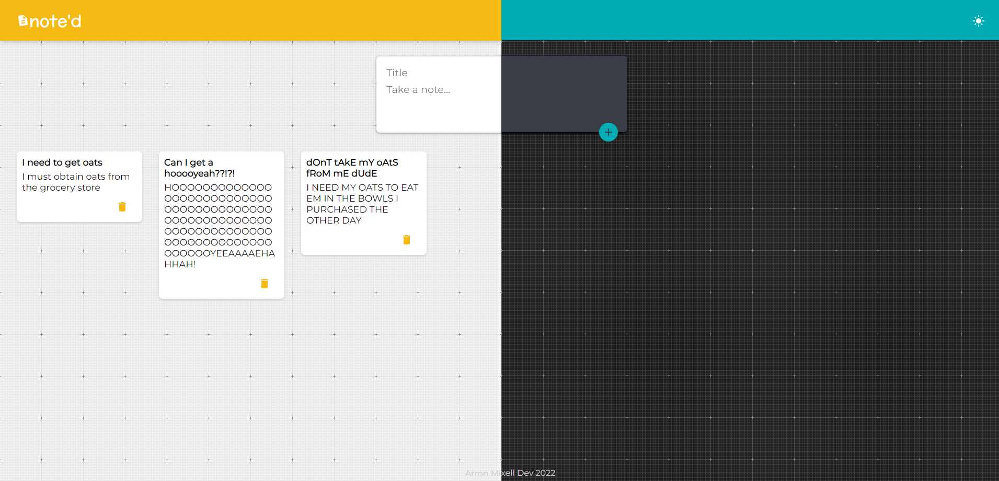
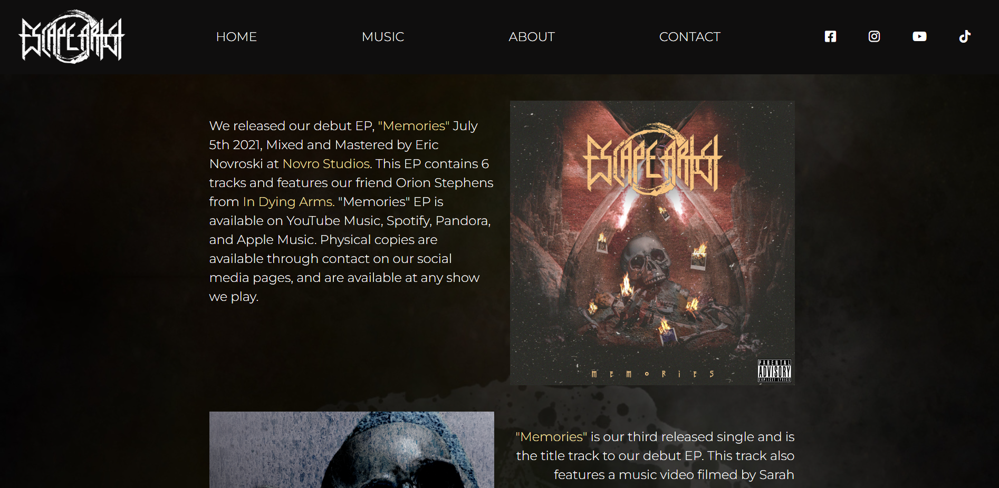
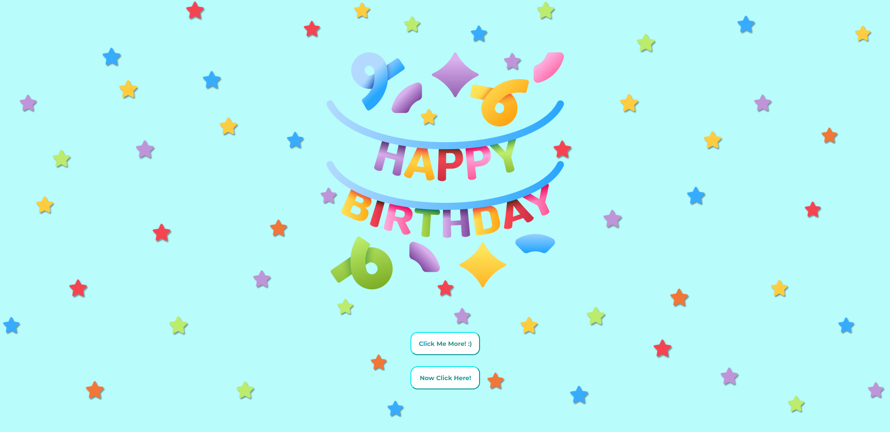
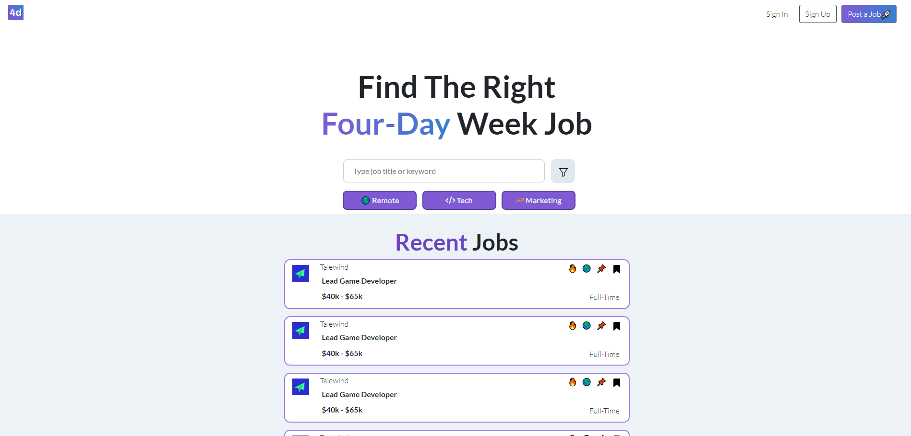
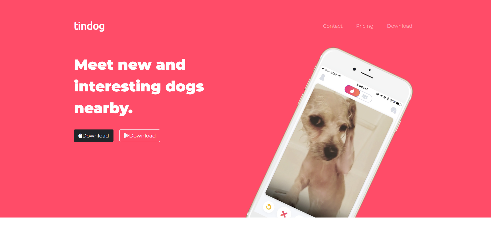
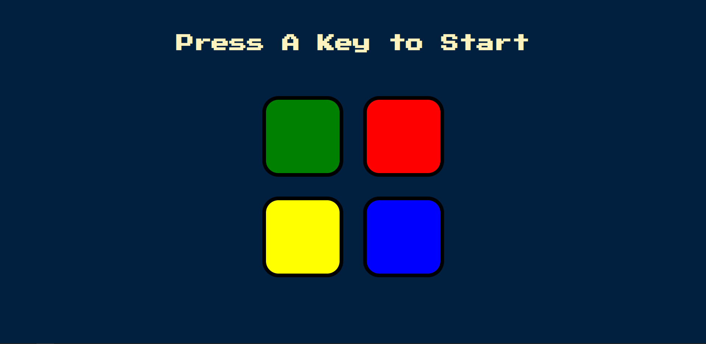
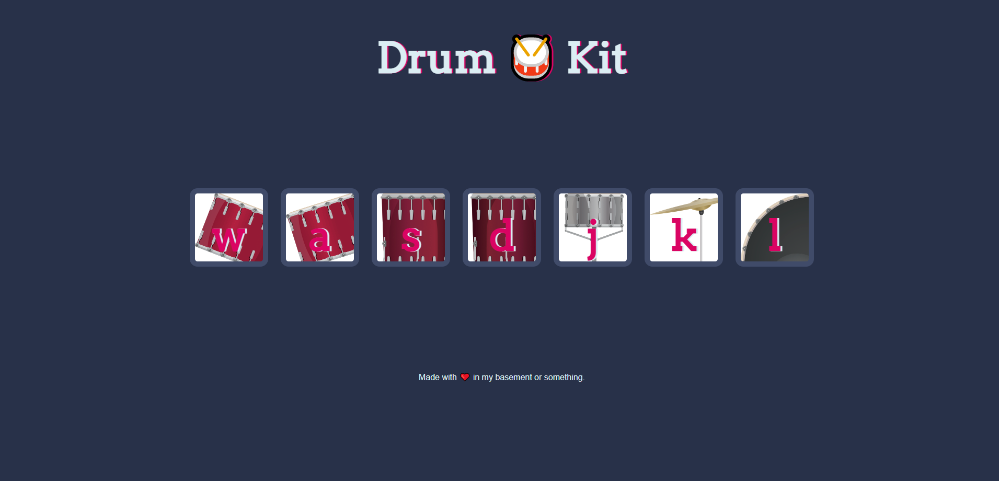
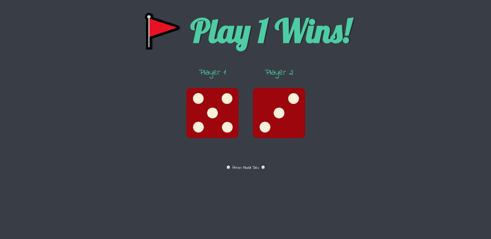

## My First Portfolio
My first shot at hosting a portfolio. Entirely made in React. At the time I thought it was awesome. However, it's not very good and I knew I could do better.
- 
- Tags: Category 1
- Badges:
  - React [yellow]
- Buttons:
  - Demo [https://react-portfolio-old.vercel.app/]
  - Code [https://github.com/zombigiraffe/react-portfolio-old]

## Native Studios
A website I made for a friend of mine for his music studio. 
- 
- Tags: Category 2
- Badges:
  - HTML [orange] 
  - CSS [teal]
  - Javascript [yellow]
  - Bootstrap [blue]
- Buttons:
  - Demo [https://www.nativestudios.net/]
  - Code [https://github.com/zombigiraffe/native-studios]

## Note'd App
A small application that you can take notes with.  
- 
- Tags: Category 3
- Badges:
  - React [yellow]
- Buttons:
  - Demo [https://noted-app-neon.vercel.app/]
  - Code [https://github.com/zombigiraffe/noted-app]

## Escape Artist Band
This is a website I made for my band. Been meaning to overhaul it.
- 
- Tags: Category 4
- Badges:
  - HTML [orange]
  - CSS [teal]
  - Javascript[yellow]
  - Bootstrap [blue]
- Buttons:
  - Demo [https://www.escapeartist.band/]
  - Code [https://github.com/zombigiraffe/Escape-Artist-Site]

## Birthday Splash
I made a website for my wife's birthday that included a fun spray of confetti when you click the center button. Then leads to a special message afterwards. I've removed the personal information and made this a template for anyone to use. 
- 
- Tags: Category 5
- Badges:
  - HTML [orange]
  - CSS [teal]
  - Javascript [yellow]
- Buttons:
  - Demo [https://zombigiraffe.github.io/birthday-template/]
  - Code [https://github.com/zombigiraffe/birthday-template]

## CSS Clone Site
I was challenged to clone a website using only HTML and CSS and I think I did a pretty good job with it.
- 
- Tags: Category 6
- Badges:
  - HTML [orange]
  - CSS [teal]
- Buttons:
  - Demo [https://zombigiraffe.github.io/4daywork-clone-site/]
  - Code [https://github.com/zombigiraffe/4daywork-clone-site]

## Tindog
Tinder for Dogs landing page. Seriously.
- 
- Tags: Category 7
- Badges:
  - HTML [orange]
  - CSS [teal]
  - Bootstrap [blue]
- Buttons:
  - Demo [https://zombigiraffe.github.io/bootcamp-tindog/]
  - Code [https://github.com/zombigiraffe/bootcamp-tindog]

## Simon Says
A janky little simon game that helped me learn programming and Javascript. 
- 
- Tags: Category 8
- Badges:
  - HTML [orange]
  - CSS [teal]
  - Javascript [yellow]
- Buttons:
  - Link [https://zombigiraffe.github.io/simon-game/]
  - Demo [https://github.com/zombigiraffe/simon-game]

## Drumkit
A playable drum kit and a learning tool I used to help learn switch statments and loops in Javascript.
- 
- Tags: Category 9
- Badges:
  - HTML [orange]
  - CSS [teal]
  - Javascript [yellow]
- Buttons:
  - Demo [https://zombigiraffe.github.io/drum-kit/]
  - Code [https://github.com/zombigiraffe/drum-kit]

## Dice Game
Just a simple little dice roll game when you refresh the page. A tool to help learn Javascript and programming.
- 
- Tags: Category 10
- Badges:
  - HTML [orange]
  - CSS [teal]
  - Javascript [yellow]
- Buttons:
  - Demo [https://zombigiraffe.github.io/dice-game/]
  - Code [https://github.com/zombigiraffe/dice-game]
